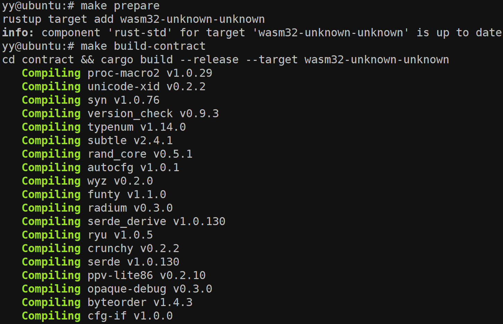
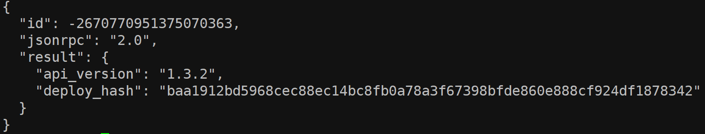
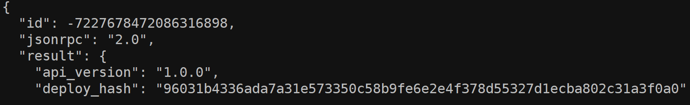

# Get Started With Casper

## 1. Create and deploy a simple, smart contract with cargo casper and cargo test
* build the contract

* test the contract

* deploy on testnet

* Check Deploy Status

## 2. Complete one of the existing tutorials for writing smart contracts(counter)
* compile to WASM


* Deploy On Testnet

* check status

* Get the NEW state-root-hash

* Increment the Counter

* Increment the Counter Again

* View the Final Network State

## 3.Demonstrate key management concepts by modifying the client in the Multi-Sig tutorial to address one of the additional scenarios(Scenario 2: Deploying with special keys)


* build the key-manager

* Test the client


* change the code 
```
const keyManager = require('./key-manager');
const TRANSFER_AMOUNT = process.env.TRANSFER_AMOUNT || 2500000000;

(async function () {
    
    // In this example the 2 additional accounts will be added to 
    // the mainAccount to perform deploys, but they will not be 
    // able to add another account. 
    
    // To achive the task, we will:
    // 1. Add first new key with weight 1 (first account).
    // 2. Set mainAccount's weight to 2.
    // 3. Set Keys Management Threshold to 2.

    let deploy;

    // 0. Initial state of the account.
    // There should be only one associated key (facuet) with weight 1.
    // Deployment Threshold should be set to 1.
    // Key Management Threshold should be set to 1.
    let masterKey = keyManager.randomMasterKey();
    let mainAccount = masterKey.deriveIndex(1);
    let firstAccount = masterKey.deriveIndex(2);

    console.log("\n0.1 Fund main account.\n");
    await keyManager.fundAccount(mainAccount);
    await keyManager.printAccount(mainAccount);
    
    console.log("\n[x]0.2 Install Keys Manager contract");
    deploy = keyManager.keys.buildContractInstallDeploy(mainAccount);
    await keyManager.sendDeploy(deploy, [mainAccount]);
    await keyManager.printAccount(mainAccount);

    // 1. Add first new key with weight 1 (first account).
    console.log("\n1. Add first new key with weight 1.\n");
    deploy = keyManager.keys.setKeyWeightDeploy(mainAccount, firstAccount, 1);
    await keyManager.sendDeploy(deploy, [mainAccount]);
    await keyManager.printAccount(mainAccount);
   
    // 2. Set mainAccount's weight to 2
    console.log("\n2. Set faucet's weight to 2\n");
    deploy = keyManager.keys.setKeyWeightDeploy(mainAccount, mainAccount, 2);
    await keyManager.sendDeploy(deploy, [mainAccount]);
    await keyManager.printAccount(mainAccount);
    
    // 3. Set Keys Management Threshold to 2.
    console.log("\n3. Set Keys Management Threshold to 2\n");
    deploy = keyManager.keys.setKeyManagementThresholdDeploy(mainAccount, 2);
    await keyManager.sendDeploy(deploy, [mainAccount]);
    await keyManager.printAccount(mainAccount);
    

 
 
})();

```

* run the client


## 4.Learn to transfer tokens to an account on the Casper Testnet
* Direct transfer


* check transfer state


## 5. Learn to Delegate and Undelegate on the Casper Testnet


* Delegate completed


* Undelegate completed


